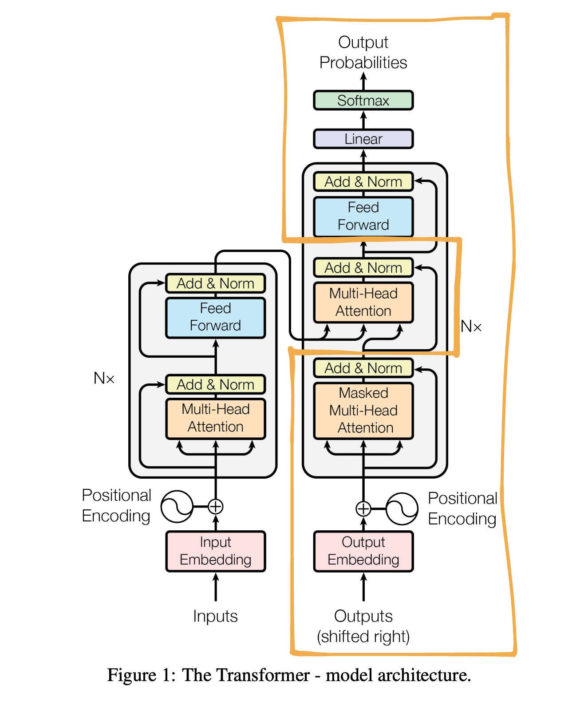
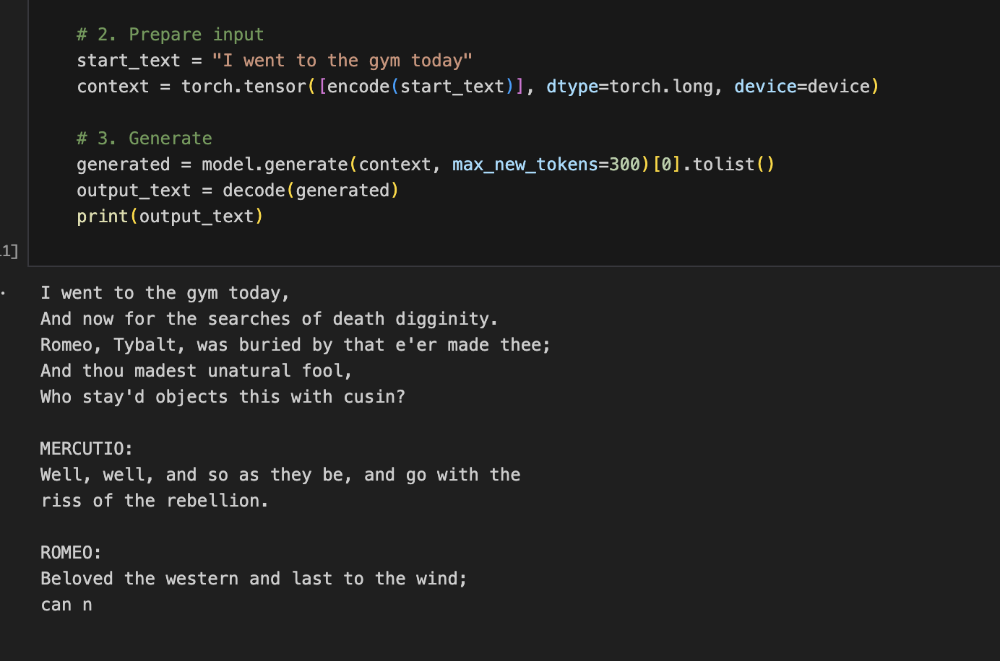

# micro-gpt
Generative Pretrained Transformer (GPT) — implemented from scratch and trained on Shakespeare’s text. This is an implementation of an amaizing tutorial by Adrej Karpathy https://www.youtube.com/watch?v=kCc8FmEb1nY .


## Overview
This repository contains two model implementations.
- `bigram-to-gpt.py`: This is a local development of the model build to run on a CPU. The author started the model development with the most simple bigram language model, and expands it into a full transformer architecture.

- `model.ipynb`: A final and enlarged version of the model, to be trained on a GPU. I used an A100 on Goolab Colab, training time ~10 mins. 

- `gpt_shakespeare.pt`: Trained model weight for the GPU model. You can run the model locally on your CPU with these weights.

- `input.txt`: dataset


## Architecture
The diagram below shows the micro-GPT architecture:



The author followed the original transformer architecture from the famous paper "Attention is all you need".
However, since this is a text generation model, and not a translator, the encoder part was left out, and only the decoder is used (within the yellow box)

**CPU Model Specs:**

- Batch size: `32`
- Input context length: `8`
- Training iterations: `3000` (approximately 73 epochs)
- Embedding size: `65` (one for each character)
- Attention heads: `1`
- Decoder blocks: `1`
- Dropout: `none`

---

**GPU Model Specs:**

- Batch size: `64`
- Input context length: `256`
- Training iterations: `5000` (approximately 73 epochs)
- Embedding size: `384`
- Attention heads: `6`
- Decoder blocks: `6`
- Dropout: `0.2`

## Requirements on CPU
- Python 3.11–3.14
- PyTorch (CUDA optional)

Project dependencies are declared in `pyproject.toml` and can be installed with Poetry.

## Setup
1) Install Poetry (if not already): https://python-poetry.org/docs/#installation  
2) From the project root, install deps:

```bash
poetry install
```

## Data
The repository expects `input.txt` (Tiny Shakespeare). If you need to fetch it:

```bash
curl -L -o input.txt https://raw.githubusercontent.com/karpathy/char-rnn/master/data/tinyshakespeare/input.txt
```
Dataset has 1,115,394 characters (in this case those are also tokens) of Shakespeares' text.

## Training and Generation

For the CPU model, run this locally to train and run the model:
```bash
poetry run python bigram-to-gpt.py
```


For the GPU model:

Run the cells of the .ipynb file in Google Colab to train and run the model.
You can also run the model locally, I have included the trained model weights (`gpt_shakespeare.pt`)

## Sample Output
Example model output after training:




## License
MIT — see `LICENSE`.
